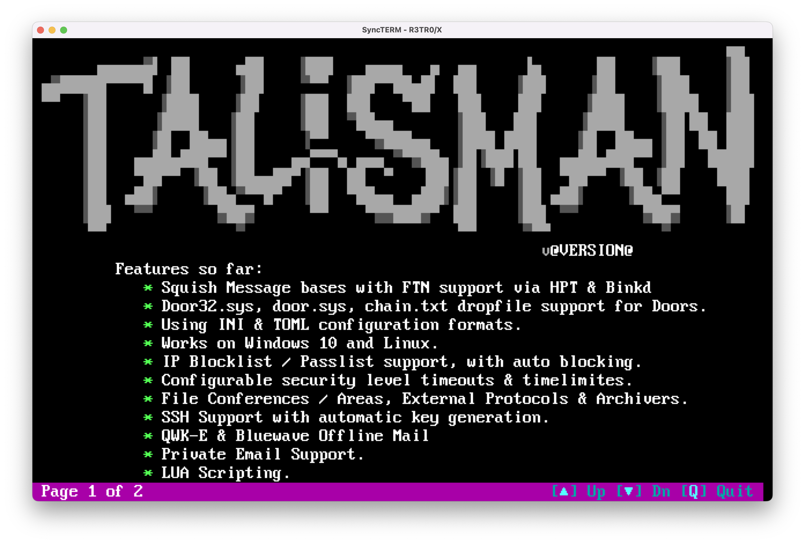

# bulletins-talisman
A Luascript alternative to Talisman BBS' built-in 'bulletins' menu.

# About 
- Bulletins by j0hnny a1pha
- v.01
- For Talisman BBS

# Features 
- Reads talisman.ini paths, bulletins.toml
- Configurable light bar position & colors
- New bulletin since last logon indicator (asterisk)
- Page up/down for full-screen reading
- Filters out SAUCE records from ANSI art
- Random menu art

# Requirements 
- Lua 5.3 installed (not 5.4):
-- `sudo apt install lua5.3`
- The LuaFileSystem (lfs) library is in your environment:
--      https://github.com/lunarmodules/luafilesystem
- TOML parser library is in your environment:
--      https://github.com/LebJe/toml.lua

# Instructions 
- Create menus art for the bulletin (e.g. bull-main1.ans, bull-main2.ans, etc)
- Create individual bulletins (e.g.bulletin1.ans, bulletin2.ans, etc)
- Add bulletin config to Talisman's data/bulletins.toml file
- Edit varaibles in bulletins.lua to your liking

